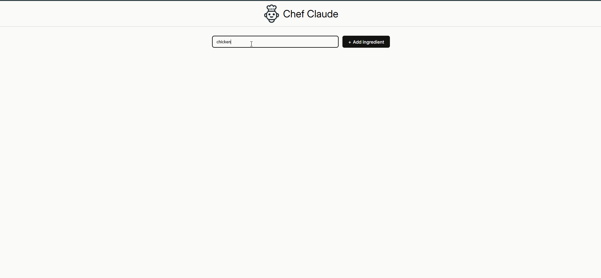

# Chef Claude

A web app that suggests recipes based on ingredients you already have on hand. Built with React and powered by the Anthropic Claude API.



## Why I built it

I wanted to go beyond following a tutorial verbatim and migrate a Scrimba-based course project to my own local environment, then deploy it. That meant resolving the parts the course glosses over: dependency management, environment variables, and most importantly, keeping API keys off the client.

## Features

- Add ingredients one at a time and see them as a running list
- Generate a recipe with Claude based on the ingredients you've added
- Recipes render as formatted markdown
- Smooth scroll to the recipe once it's generated
- Clear all ingredients with one click

## Tech stack

- **React 19** with hooks (`useState`, `useEffect`, `useRef`)
- **Vite 8** for the dev server and bundler
- **Anthropic SDK** (`@anthropic-ai/sdk`) for Claude API calls
- **react-markdown** for rendering Claude's markdown output

## Running locally

```bash
git clone https://github.com/Clevert3ch/chef-app.git
cd chef-app
npm install
```

Create a `.env` file in the project root: here you will need an Anthropic API key. ( i have excluded mine so it doesnt get missused.) 

Then start the dev server:

```bash
npm run dev
```

The app will be available at `http://localhost:5173`.

## Notes on security

The current local-development version uses `dangerouslyAllowBrowser: true` and exposes the API key to the client bundle. This is fine for local use but unsafe for public deployment — anyone could inspect the bundle and recover the key.

The deployable version (in progress) moves the Anthropic call to a serverless function so the key never reaches the browser.

## What I learned

- Migrating a project off a learning platform forced me to actually understand the tooling (Vite config, env var conventions, peer dependency resolution) instead of taking it for granted.
- The difference between `process.env` and `import.meta.env` and why Vite uses the latter.
- Why API keys in client code is a real problem and what serverless functions solve.
